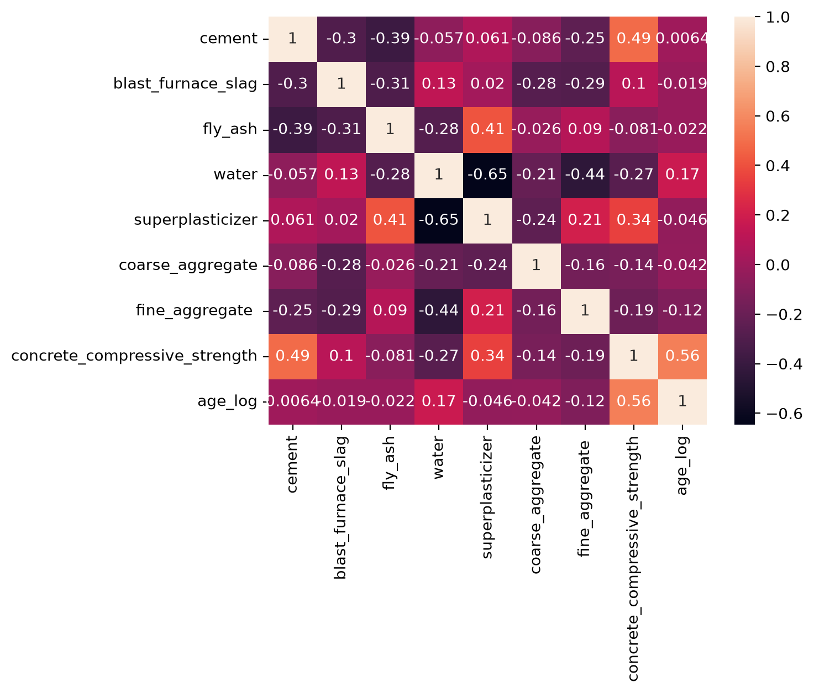
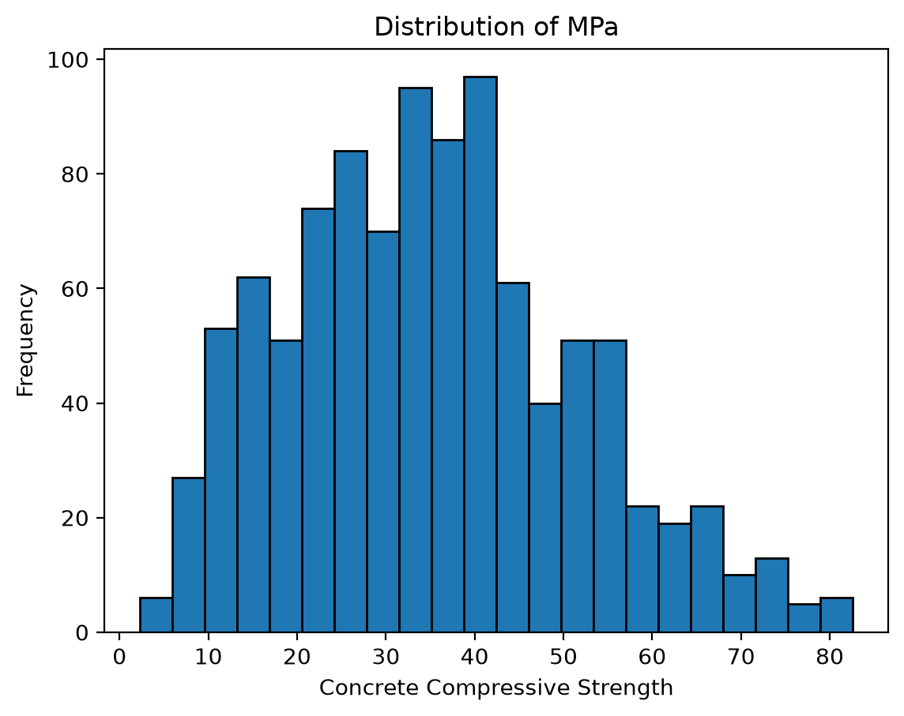
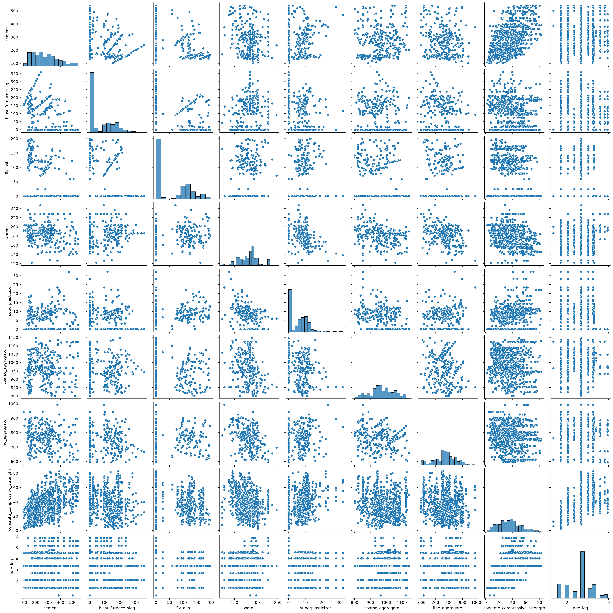

# Concrete Strength Linear Regression
Predicting concrete compressive strength (MPa) (linear regressioon)

I created this project to test my knowledge on what i learned from ML Specialization by Andrew NG.

## Problem
Predict concrete compressive strength (measured in MPa) based on the mix's ingredient quantities (cement, water, fly ash, etc.) and curing age.

## Dataset
Source: [concrete_data](https://www.kaggle.com/datasets/elikplim/concrete-compressive-strength-data-set)

## Approach
1. First i import libraries we need and load the data
2. When loading data i use read_csv.
3. Then i observe properties of data i have.
4. While Data Overview and Visualization i see that there is dublicate datas, some features are non-linear and has weak relationship with our target. I also observed that 'age' feature varies a lot.
5. Then i split 80/20 for train and test.
6. I used Pipeline to make things automated instead of doing things manually as writing StandardScaler each time for features and target. GridSearch CV helps to automatically test and choose Regularization parameter and Polynomial degree.
7. Then i train the model.
8. And lastly evaluate the results i got.

## Results
### Heatmap of Correlation

### Distribution of Concrete Compressive Strength

### Pair Relationship

### Model Results

| Metric | Value |
|--------|-------|
| Mean Absolute Error | 3.529 |
| Mean Squared Error | 26.738 |
| RMSE | 5.171 |
| R² Score (test) | 0.910 |

### Hyperparameter Tuning

| Parameter | Value |
|-----------|-------|
| Best Alpha (Lasso) | 0.01 |
| Best Polynomial Degree | 6 |
| R² Train Score | 93.69% |
| R² Test Score | 91.04% |

## Setup instruction
1. Download dataset i referenced above
2. Unzip and add it to data/ folder
3. Open new terminal inside project (can be done with 'Ctrl' + 'Shift' + '`')
4. Write 'pip install -r requirements.txt'

## Progress Log
 
| Date | Commit |
|------|--------|
| 8 July | Initializing the Project and Creating the Model |
| 8 July | Improving Model Significantly with Help of Polynomial Degree and Lasso |
| 8 July | Finalizing Project by lastly finishing README |
| 9 July | Adding My Credit Card Customer Segmentation Project to README |
| 10 July | Adding My Network Intrusion Detection with Random Forest & XGBoost |

## Link to other repositories i have
- [My Student Pass/Fail ML Project](https://github.com/BadalovSanan/My-StudentPassFail-ML-Project)
- [Casting Product's Deffect Detecting](https://github.com/BadalovSanan/casting-defect-logistic-regression)
- [Credit Card Customer Segmentation](https://github.com/BadalovSanan/credit-card-customer-segmentation)
- [Network Intrusion Detection with Random Forest & XGBoost](https://github.com/BadalovSanan/Network-Intrusion-Detection-with-Random-Forest-and-XGBoost)
